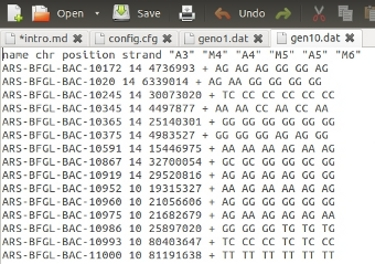
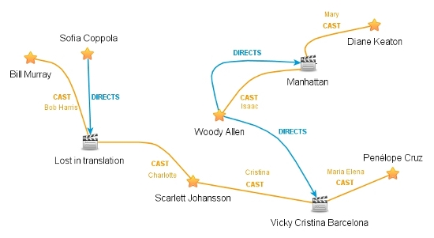
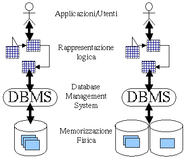

# Databases

---

## What is a database?

Organised collection of data (logically related)

- text file (e.g. pedigree and genotype files)
- spreadsheet (e.g. MS Excel, LibreOffice Calc)

&nbsp;

---

## Relational database

1970: Edgar F. Codd "A Relational Model of Data for Large Shared Data Banks"
Tables and relations
    - each table contains data pertaining to one entity
    - table-columns: *fields* (entity attributes or properties)
    - table-rows: *records* or *tuples* (entity occurrences)

Source: [The relational model for database management: version 2](http://dl.acm.org/citation.cfm?id=77708&CFID=333588886&CFTOKEN=24725704)
{: .smaller .note}

---

## Fancier databases

- Graph database (nodes and connections)
- Semantic data model
- Chado database (GMOD: generic model organism database)

---

## DBMS

* Input, storage, retrieving & management of data
* Database Management System: software
    - interface users/physical data storage
{: .small}
    - independence between physical and logical data representation (e.g. disk/partition change)
{: .small}

{: .lessspacebefore}

---

## RDBMS

- access data through a conceptual -rather than physical- scheme
- share data between different apps
- manage simultaneous access to data
- ensure data integrity and safety
<!-- {: .smaller} -->

Relational databases: most popular!
*RDBMS*: relational db management system

---

## MySQL

* Several RDBMS (SQLite, Microsoft SQL Server, PosgreSQL etc ...)
* MySQL 5.5 (open source)
    * from 5.0 comparable to high-performing commercial solutions
{: .smaller}

*SQL*: reference 'programming' language for relational databases 

Source: [MySQL](http://dev.mysql.com/doc/refman/5.5/en/index.html)
{: .smaller .note}

