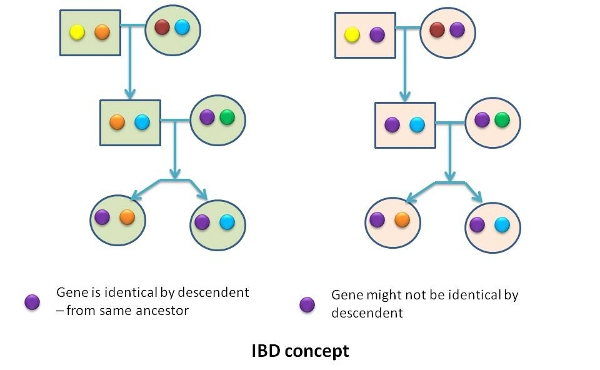

# The pedigree relationship matrix

---

## Genetic relationships

- Related individuals (parent-offspring, siblings, ) look alike
<!--{: .smaller}-->
- Identical by state (*IBS*) vs Identical by descent (*IBD*)
<!--{: .smaller}-->

---

## Coefficient of kinship, *f*

* a.k.a. *coefficient of coancestry* or *Malécot relationship*
* Probability of IBD between two individuals (*X{i,j}* and *Y{m,n}*)
* \\\(f_{X,Y}:[0,1]\\\) (it's a probability!)

\\\(f_{X,Y}=\frac{p(i \equiv m)+p(i \equiv n)+p(j \equiv m)+p(j \equiv n)}{4}\\\)
{: .formula}

* Probability that a randomly drawn allele from X is IBD to a randomly drawn allele from Y

---

## Parent - offspring

* *P{i,j}*
* offspring can inherit either allele *i* or allele *j*

\\\(f_{P,O}=\frac{p(i \equiv m)+p(i \equiv n)+p(j \equiv m)+p(j \equiv n)}{4}=\frac{1+0+0+0}{4}=\frac{1}{4}\\\)
{: .formula}

* *i* or *j* with equal probability (\\\(\frac{1}{2}\\\))

\\\(f_{P,O}=\frac{1}{2}\times\frac{1}{4}+\frac{1}{2}\times\frac{1}{4}=\frac{1}{4}\\\)
{: .formula}

* the parent-offpsring kinship is \\\(\frac{1}{4}\\\)

---

## Full sibs

* 16 possible genotype configurations (equiprobable!)

 FS1 | FS2 | \\\(f_{FS1,FS2}\\\) 
-----|-----|---------------------
 i,m | i,m | \\\(\frac{1}{2}\\\) 
 i,m | i,n | \\\(\frac{1}{4}\\\) 
 i,m | j,m | \\\(\frac{1}{4}\\\) 
 i,m | j,n | \\\(0\\\) 
 i,n | i,m | \\\(\frac{1}{4}\\\) 
 i,n | i,n | \\\(\frac{1}{2}\\\) 
 i,n | j,m | \\\(0\\\) 
 ... | ... | ...

* the kinship between full sibs is \\\(\frac{1}{4}\\\)

---

## Additive genetic relationship, **a**

* Sewell Wright (American geneticist, \\\(20^{th}\\\) century)
* resemblance between the breeding values (BVs) of two individuals
* related to kinship
* but **2** alleles per locus \\\(\rightarrow\\\) BV is combined effect of the 2 alleles
* \\\(a_{X,Y}=2f_{X,Y}\\\)
* the kinship is a probability, the additive genetic relationship is not (\\\([0,2]\\\))

---

## Additive genetic relationship, **a**

* \\\(a_{X,Y}\\\) is the correlation between the breeding values of X and Y

\\\(a_{X,Y}=\frac{Cov(BV_X,BV_Y)}{\sigma_{BV_X}\sigma_{BV_Y}=\sigma^2_{BV}=\sigma^2_A}\\\)
{: .formula}

* e.g. additive genetic relationship of a non-inbred individual with itself

\\\(a_{X,X}=\frac{Cov(BV_X,BV_X)=\sigma^2_{BV_X}=\sigma^2_A}{\sigma^2_A}=\frac{\sigma^2_A}{\sigma^2_A}=1\\\)
{: .formula}

* the situation is more complex with inbreeding (e.g. \\\(a_{X,Y}>1\\\))

---

## The A matrix

- matrix of additive genetic relationships among individuals
- symmetric with diagonal equal to \\\(1+F_i\\\)
- \\\(A\sigma^2_a\\\) \\\(\rightarrow\\\) covariance among additive genetic values (BVs)

**Methods to compute A**
1. compute kinship, then double it
2. path coefficients method (Wright, 1922)
3. recursive method (Henderson, 1976)

---

## The recursive method

1. code individuals in the pedigree from 1 to n
2. order them by birthdate (parents before their progeny)
3. if both parents (s AND d) of *i* are known: 
    - \\\(a_{ji}=a_{ij}=0.5(a_{js}+a_{jd})\\\)
{: .smaller}
    - \\\(a_{ii}=1+0.5a_{sd}\\\)
{: .smaller}
4. only one parent is known (s OR d):
    - \\\(a_{ji}=a_{ij}=0.5(a_{js})\\\), \\\(a_{ii}=1\\\)
{: .smaller}
5. parents are unknown:
    - \\\(a_{ji}=a_{ij}=0\\\), \\\(a_{ii}=1\\\)
{: .smaller}

Source: [Henderson, 1976](http://dev.mysql.com/doc/refman/5.5/en/index.html)
{: .smaller .note}

---

## The A matrix - example

Animal | Sire | Dam
-------|------|-----
   3   |  1   |  2
   4   |  1   |  - 
   5   |  4   |  3 
   6   |  5   |  2 

\\\(a_{11}=1\\\)
\\\(a_{12}=0\\\)            &nbsp;&nbsp;&nbsp;&nbsp;&nbsp;&nbsp;&nbsp;&nbsp;&nbsp;&nbsp;&nbsp;&nbsp;&nbsp;&nbsp;&nbsp;&nbsp;&nbsp;&nbsp;&nbsp;&nbsp;&nbsp;&nbsp;&nbsp;[both parents unknown]
\\\(a_{13}=0.5(1+0)=0.5\\\) &nbsp;&nbsp;[known parents]
\\\(a_{14}=0.5(1)=0.5\\\)   &nbsp;&nbsp;&nbsp;&nbsp;&nbsp;&nbsp;&nbsp;&nbsp;&nbsp; [one known parent]
\\\(a_{15}=0.5(0.5+0.5)=0.5\\\)
\\\(a_{16}=0.5(0.5+0)=0.25\\\)
...

