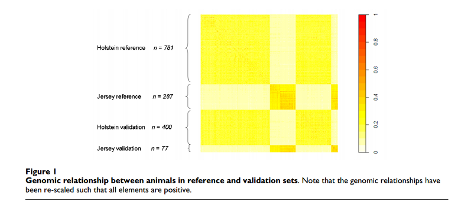

# The matrix of genomic relationships

---

## Genomic relationships

* pedigree \\\(\to\\\) *average relationships*
* e.g. fulls-sibs: \\\(a_{FS}=0.5\\\)
* theoretically: \\\(0\leq a_{FS}\leq1\\\)
* [actually: \\\(a_{FS}=0.5 \pm 0.04 \\\) (Guo, 1996)]
{: .smaller}
* genotypes \\\(\to\\\) *realised relationships*

**Several methods to compute genomic relationships**:
    - VanRaden, 2008: *Efficient methods to compute genomic predictions*
{: .smaller}

Source: [VanRaden, 2008](http://193.190.200.21:65001/cours/GN202/Exercices/VanRaden2008.pdf)
{: .smaller .note}

---

## The G matrix

* \\\(M_{n,m}\\\): matrix of marker genotypes per individual (*n* individuals, *m* markers)
* -1: aa; 0: Aa; 1: AA
* \\\(P_{n,m}\\\): matrix of allele frequencies as differences from 0.5
* \\\(\boldsymbol{Z}=\boldsymbol{M}-\boldsymbol{P}\\\)
* \\\(\boldsymbol{G}=\frac{\boldsymbol{Z}\boldsymbol{Z'}}{2\sum p_i(1-p_i)}\\\)

---

## The G matrix: heatamap

