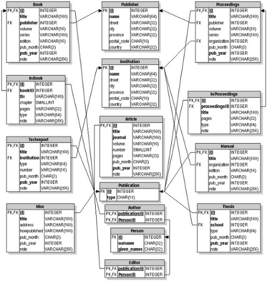
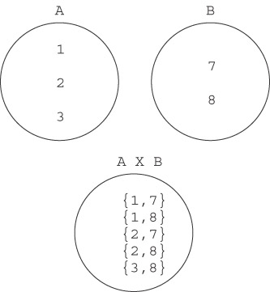

# Databases: an example

---

## The bibliography database

* A database of information on publications (several related tables)
* *Publication*, *Author*, *Editor*, *Publisher*, *Institution*, *Book*, *InBook*, *Proceedings*, *Article*, ...
* Each table, its attributes
* Links between tables (PK, FK)

---

## Links between tables

- **Book &larr; &rarr; Publisher**
- In *Book* no data on the publisher, but a number/code (FK) linked to the table *Publisher* (here PK)
- **Person &larr; Author (2FKs) &rarr; Publication**
- *Author* can't be linked directly to types of publication (*Article*, *Book* etc ..): authors can write publications of different types, and this would cause PubID to be FK to multiple tables (contradicting its definition)

---

## Linked tables

| ID | Name | Surname | Age | Country |
|----|------|---------|-----|---------|
| 1  | Roy  | Rob     | 35  | Ireland |
| 2  | Tom  | Cook    | 53  | Wales   |

&nbsp;
{: .smaller}

| ID | PubID | PersID | 
-----|-------|--------|
| 1  | 10    |  1     |
| 2  |  2    |  1     |

&nbsp;
{: .smaller}

| ID  | PubType | 
|-----|---------|
| 1   | Article |
| 2   | Book    |

---

## The logical data model

---

## Create a database

An SQL database is a set of tables (relations)

    CREATE DATABASE name_database

Our example:

    CREATE DATABASE bibliography

---

## Create a table

    CREATE TABLE table_name (
    column_name column_type 
        [ default_clause ] [ column_constraint ]
    [ , column_name column_type 
        [ default_clause ] [ column_constraint ]
     … ]
    [ , [ table_constraint] … ] )

*column_type*: character, integer, float, date, timestamp ...

*default_clause*: default attribute value in case it is not specified

    DEFAULT { valore | NULL }

---

## Column and Table constraints

- NOT NULL
- PRIMARY KEY
- FOREIGN KEY (REFERENCES ...)
- CHECK (conditional expression)
    - e.g. CHECK(column1 < 1000) &rarr; column1 accepts only values < 1000
{: .smaller}

Table constraints are like column constraints but applied to multiple columns (e.g. PRIMARY KEY ( col1 [ , col2 ... ] ))

---

## Create tables

    CREATE table Publication (
        ID INTEGER PRIMARY KEY,
        type CHAR(18) NOT NULL
    );

    CREATE table Author (
      publicationID INTEGER REFERENCES Publication(ID),
      personID INTEGER REFERENCES Person(ID),
      PRIMARY KEY (publicationID, personID)
    );

*create_biblio.sql*

---

## Populating the database

"Across-Line SNP Association Study for Direct and Associative Effects on Feather Damage in Laying Hens". F. Biscarini, H. Bovenhuis, J. van der Poel, T. B. Rodenburg, A. P. Jungerius, J. A. M. van Arendonk. Behavior Genetics (2010) 40:715–727
{: .smaller}

Insert:
- 6 rows in *Person*
- 1 row in *Publication*
- 1 row in *Article*
- 6 row in *Author*
- 1 row in *Publisher*

---

## Insert a record in the database

    INSERT INTO table_name [ ( fields ) ]
    VALUES ( values )

    INSERT INTO Person 
    VALUES ( 1, ‘Biscarini’, ‘Filippo’ );

    INSERT INTO table_name [ ( fields ) ]
    Select statement

&iexcl; Insert into a table data coming from another table (SELECT) !

---

## Retrieve data from the database

    SELECT field_name FROM table_name
        [options]

**LIKE**: to extract records whose specified attribute value is similar to a pattern
- **%** to substitute any number of characters
- **_** to substitute just one character

    SELECT * FROM Person
    WHERE surname LIKE 'B%'

---

## Select from multiple tables

Cartesian product
{: .abitlessspacebefore}

    SELECT T1.*, T2.*
    FROM T1, T2
    WHERE T1.PK=T2.FK

---

## Select from multiple tables
Inner Join

    SELECT T1.*, T2.* 
    FROM T1 INNER JOIN T2
    ON T1.PK=T2.FK

---

## Operators and functions

**IN**: specigy multiple values in a WHERE clause
 
    SELECT * FROM table WHERE column IN (val1,val,..);

**COUNT(column_name)**: returns the number of rows that match a specified criterion

    SELECT (*) FROM table; #n. of records in table

    SELECT COUNT(DISTINCT column_name) FROM table_name;

---

## Modify table data

    UPDATE Person
    SET given_names = 'Annemike'
    WHERE surname = 'Jungerius'

    DELETE FROM table_name
    [ WHERE conditional expression ]

---

## Modify table structure

    DROP table table_name 

    ALTER table table_name 
    ADD [ COLUMN ] col_definition

    ALTER table table_name
    DROP [ COLUMN ] col_name

---

## The Computer Store

2 tables:
- Manufacturer (Code, Name)
- Products (Code, Name, Price, Manufacturer)

M.Code &larr; &rarr; P.Manufacturer

Create and populate tables into db "test"

---

## Exercises

1. Select the names of all the products in the store
2. Select the names and the prices of all the products in the store
3. Select the name of the products with a price less than or equal to $200 
4. Select all the products with a price between $60 and $120 [AND or BETWEEN]
5. Select the name and price in cents (i.e., the price must be multiplied by 100)
6. Compute the average price of all the products [AVG()]

---

## Exercises - continued

<ol start="7">
<li>Compute the average price of all products with manufacturer code equal to 2</li>
<li>Compute the number of products with a price larger than or equal to $180</li>
<li>Select the name and price of all products with a price larger than or equal to $180, and sort first by price (in descending order), and then by name (in ascending order)</li>
<li>Select all the data from the products, including all the data for each product's manufacturer</li>
<li>Select the product name, price, and manufacturer name of all the products</li>
<li>Select the average price of each manufacturer's products, showing only the manufacturer's code</li>
</ol>
---

## Exercises - continued

<ol start="13">
<li>Select the average price of each manufacturer's products, showing the manufacturer's name</li>
<li>Select the names of manufacturer whose products have an average price larger than or equal to $150 [HAVING]</li>
<li>Select the name and price of the cheapest product [MIN()]</li>
<li>Select the name of each manufacturer along with the name and price of its most expensive product [MAX()]</li>
<li>Add a new product: Loudspeakers, $70, manufacturer 2</li>
<li>Update the name of product 8 to "Laser Printer"</li>
<li>Apply a 10% discount to all products</li>
<li>Apply a 10% discount to all products with a price larger than or equal to $120</li>
</ol>

