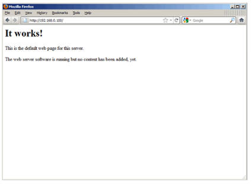

# Getting started: the database working environment 

---

## Installing MySQL (Linux)

    sudo su
(root privileges)
{: .small}

    apt-get install mysql-server mysql-client

(install MySQL -typically latest available distribution, e.g. 5.5)
{: .small}

asked to provide a *password* (MySQL root user -root@localhost)
{: .smaller}

Source: [mySQL on Ubuntu](https://help.ubuntu.com/12.04/serverguide/mysql.html)
{: .smaller .note}

---

## Installing a web-server

Installing *Apache2*

    apt-get install apache2

Browser: go to *http://127.0.0.1* (or *htpp://localhost*): should display the Apache2 default page (see below)
{: .smaller}

Source: [Apache Foundation](http://www.apache.org)
{: .smaller .note}

---

## Installing PHP

*PHP* (Hypertext Pre-Processor)

    apt-get install php5 libapache2-mod-php5

restart the Apache server

    /etc/init.d/apache2 restart

Source: [PHP](http://www.php.net)
{: .smaller .note}

---

## Testing PHP

Create a text file names *info.php*
{: .smaller}

    <?php
        phpinfo();
    ?>

Open it via browser: *localhost/info.php*
{: .smaller .shrink .flotar}

---

## PHP & mySQL

Install PHP modules to work with MySQL
{: .smaller .lessspaceafter}

    apt-get install php5-mysql php5-curl php5-gd 
    php5-idn php-pear php5-imagick php5-imap 
    php5-mcrypt php5-memcache php5-ming php5-ps 
    php5-pspell php5-recode php5-snmp php5-sqlite 
    php5-tidy php5-xmlrpc php5-xsl

Restart the Apache server
{: .smaller .lessspaceafter}

    /etc/init.d/apache2 restart

---

## PhpMyAdmin

Web-interface to manage a MySQL database

    apt-get install phpmyadmin

Web server to reconfigure automatically: *apache2*
Configure database for phpmyadmin with dbconfig-common? *Yes*
{: .smaller}

Access via *http://localhost/phpmyadmin*

