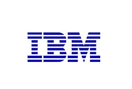

# SQL: an overview

---

## Brief history

1974: Donald Chamberlain, IBM lab

1. SEQUEL
2. SQL

'80s: first commercial SQL-based dbs (IBM, Oracle)

1986: SQL adopted by ANSI

---

## Structured Query Language (SQL)

* Query: every instruction sent to a database
    - retrieve data
{: .small}
    - insert records
{: .small}
    - update records
{: .small}
    - delete records
{: .small}
    - create a new database
{: .small}
    - create new tables
{: .small}
    - set permissions on tables
{: .small}
    - ...
{: .small}
* Programming Language to manage data in a relational database (RDBM) 

Source: [SQL: reference site](http://www.sql.org/)
{: .smaller .note}

---

## Simple syntax

* All the actions you need to perform on a database are done with *SQL statements*
* SQL is NOT case sensitive: SELECT is the same as select
    - however, *we will use uppercase*
{: .smaller}
* Semicolon (* ; *) should be added at the end of each SQL statement
* Semicolons separate each SQL statement when multiple queries are executed.

---

## The SELECT statement

Used to extract data from a database

    SELECT column_name,column_name
    FROM table_name;

Select everything from a table:

    SELECT * FROM table_name;

Select distinct elements of a field:

    SELECT DISTINCT column_name FROM table_name;

---

## WHERE & ORDER BY

WHERE clause
    
    SELECT column_name 
    FROM table_name 
    WHERE column_name condition;

ORDER BY keyword

    SELECT column_name
    FROM table_name
    ORDER BY column_name ASC|DESC;

---

## INSERT statement

Used to insert data into a database

    INSERT INTO table_name
    VALUES (value1,value2,value3,...);

Specifying which columns:

    INSERT INTO table_name (column1,column2,column3,..)
    VALUES (value1,value2,value3,..);

